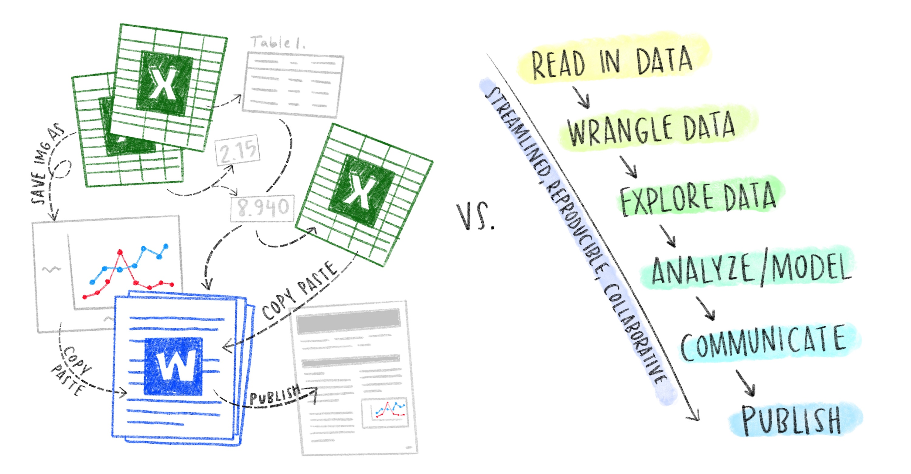

# Programming, R, and Python {#r-py}

## What is programming? 

Programming is the process of designing then telling a computer instructions to do something useful for you, usually by taking an input and producing some meaningful output.

For example, if you've found a mean value using the `AVERAGE()` function in Excel, that's programming. But have you ever looked back at an analysis you've done in Excel weeks or months (or years) later, and tried to follow your work start to finish? It's...not great. 

Throughout your MEDS courses you'll learn to programming by writing *code* to keep clear, complete and readable records of everything we do with environmental data - from accessing it to preparing final reports. In doing so, you'll build workflows to make your data science reproducible, so that you, your collaborators, or other people can re-run your code completely from start-to-finish. 

```{r, echo=FALSE, out.width="100%", fig.cap="How it started, and how we hope it's going after MEDS.", fig.align = "center"}
  
```

Scripted code will become the core component of our reproducible data science. There are **hundreds** of coding languages - to feel immediately overwhelmed, you're encouraged to check out Wikipedia's [list of notable programming languages](https://en.wikipedia.org/wiki/List_of_programming_languages) [@enwiki_1014039839]. But **don't panic**, we're going to build programming skills in just two of those during EDS 221 - R and Python - because they are some of the most commonly used languages in environmental data science across sectors. 

Is it possible that you'll join a team using a different language? Sure. However, a strong foundation in a few representative programming languages, along with a basic set of tools for reproducible, collaborative work, will allow you to transfer your skills quickly to other languages, IDEs, or teams as they arise in your career. 

So let's start with our most critical tool: our coding languages. 

## R 

R is a programming language - a language with unique syntax and expectations for how you will give your computer instructions. 


## Python

You probably have Python 3 already installed if you have a recent-ish computer. If not, you'll want to install it. How can you run some Python code without anything else? 

- Open the Terminal on your device (Cmd + Spacebar), open the Terminal
- Run `python` (press Enter) - this will tell you which version of Python you're using, and switch over into a Python interpreter. 
- Now you're using this as a Python editor (you should see the `>>>` starting each line, prompting Python code. Try running some basic code, like: 

- `print("data science")`
- `2 + 10`
- `for i in 1, 2, 3, "hooray": print(i)` [press Enter twice to run...otherwise it's like "are you really done with this loop?"]
- `help()` will open interactive Python help...then go exploring following along with some of the instructions there! 

Can you run Python entirely through the Terminal? Sure. But that'd be a bummer. Instead, we'll learn some more data scientist-friendly places to write, run and explore Python code, including in Py scripts, Jupyter Notebooks, and even in R Markdown. 

## RStudio

## Jupyter Notebooks (??? not sure)

### Py stuff to add here or somewhere: 

Random things on Allison's to-add list

- Zero index (offset) differs from one index 
- Open Python interpreter (run `$ python` in Terminal to return info about your Python version, and open the interpreter starting with `>>>`)
- Pressing 'Enter' twice: doesn't know if you want to add more (R assumes you don't want to), e.g. at the end of a for loop
- Save Python script (written in plain text file) save as test.py, go to that dir, run `$ python test.py` to actually run your python script (e.g. do this in RStudio to demo)
- Type, id, value (what kind of data, what it's called, the value compatible with the type (ref Lubanovic))
