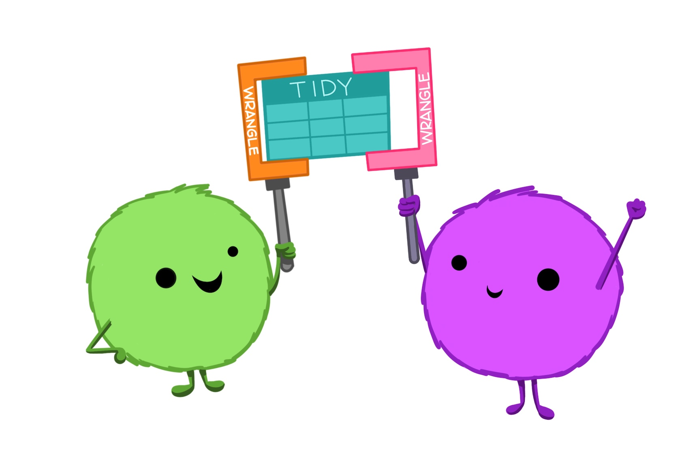

# Tidy data {#tidydata}

Note: all artwork in this chapter are from an illustrated collaborative [Openscapes blog post](https://www.openscapes.org/blog/2020/10/12/tidy-data/) by Dr. Julia Lowndes and Dr. Allison Horst [@lowndes_tidy_2020].

Tidy data is a predictable way to organize data that makes it more coder and collaborator friendly. As described by Hadley Wickham, **in *tidy data* each column is a variable, each row is an observation, and each cell contains a single value (measurement)** [@wickham_tidy_2014].

{width="600"}

This may seem like a mundane topic, but tidy data provides a way of thinking about and organizing data that will become fundamental to how you input, wrangling, and work with environmental data - it becomes part of a systematic approach to working with data that **will make you a better data scientist and collaborator**.

## Common ways data are untidy

One way to understand tidy data is to consider what makes some data sets *untidy*. Let's explore some examples of untidy data, and for each think about (1) why it's untidy, and (2) how we would wrangle it to make it tidy data.

### Untidy example 1: A single variable across multiple columns

One of the most common ways that data can be untidy is if a single variable is broken up by group across multiple columns. For example, the following data contains the weights of three dogs, measured over four years:

```{r, echo = FALSE, message = FALSE, warning = FALSE}
library(tidyverse)
library(kableExtra)
dog_wt_wide <- tribble(~dog, ~'2018', ~'2019', ~'2020', ~'2021',
                       "Teddy", 36.4, 39.2, 44.8, 47.5,
                       "Khora", 41.6, 48.3, 52.9, 50.1,
                       "Waffle", NA, NA, 20.4, 23.7
)

dog_wt_wide %>% kable(caption = "Dog weight (pounds) in untidy format, where a single variable (weight) is spread out across different levels of the year variable.") %>% kable_styling(full_width = FALSE, position = "center")
```

In this example, there are really only 3 variables: dog name, dog weight, and year. But as organized, there are **5** columns - this should be our first indication that the data is not tidy. Instead of each variable occupying its own column, the **weight** measurements have been split up across multiple columns, separated by the different levels of **year**. Sometimes you will hear this called "wide format" when a single variable is spread across multiple columns.\
\
**What would this data look like if it were tidy?**\
\
To be in tidy data, each variable (**dog**, **weight**, and **year**) should have its own column. In this example, starting from the wide format data we need to reshape **weight** observations into a single column. Year will need to populate a new column, with year values repeated as necessary to align with the long-format weights. We'll also need to repeat the dog names to accommodate the number of observations for each.\
\
Later on, we'll hear how to reshape data from wide-to-long format (e.g. using `tidyr::pivot_longer()` in R), but for now think about the tidy format of the same data, shown below:

```{r, echo = FALSE, message = FALSE, warning = FALSE}
dog_wt_wide %>% pivot_longer(cols = '2018':'2021', names_to = "year", values_to = "weight") %>% 
  kable(caption = "Dog weight (pounds) in tidy format, where each variable is in its own column.") %>% 
  kable_styling(full_width = FALSE, position = "center")

```

### Untidy example 2: multiple values in a single cell

Another way that data can be untidy is if there are multiple "measurements" (or values) in a single cell. Keep in mind that a "value" doesn't have to be numeric - it's just a measurement or description for a recorded variable.

Sometimes raw data will contain multiple values in a single cell. For example, here we see that the make, model and year of cars are all in a single column called **type**:

```{r echo = FALSE, message = FALSE, warning = FALSE}

cars_untidy <- tribble(~type, ~color, ~condition,
                       "1994 Toyota Corolla", "silver", "poor",
                       "2005 Subaru Outback", "green", "average",
                       "1977 Datsun 710", "blue", "excellent")

cars_untidy %>% 
  kable(caption = "Car descriptions in untidy format.") %>% 
  kable_styling(full_width = FALSE, position = "center")

```

An important thing is to be future-thinking about data, and expect that **even if you don't think a specific question is important now, it may be important in the future** -- and having data in tidy format will make it easier to answer a wider range of questions with limited frustration. For example, maybe in the future (and if this were part of a larger data set) we would want to assess the condition of cars by year, or the color of cars by make and model. No matter how you slice those questions, having each variable in its own column will make them easier to explore and answer with code.\
\
In the future, you'll learn how to separate components of a single column into multiple columns (e.g. using the `tidyr::separate()` function), which in this example would help to create a tidy version of the data that looks like this:\

```{r, echo = FALSE}

cars_untidy %>% 
  tidyr::separate(col = type, into = c("year", "make", "model"), sep = " ") %>% kable(caption = "Car descriptions in tidy format.") %>% kable_styling(full_width = FALSE, position = "center")

```

**Untidy example 3: multiple observations in a single row**

Occasionally, you will see environmental data where information for *multiple observations are stored in a single row*. For example, this is common when research divers are estimating numbers of a certain species within different size bins. For example, a dive record may contain information like this:

```{r, echo = FALSE, message = FALSE, warning = FALSE}

invert_counted <- tribble(~species, ~size_cm, ~count,
                          "spiny lobster", 4.5, 2,
                          "spiny lobster", 5.0, 4,
                          "spiny lobster", 5.5, 0,
                          "spiny lobster", 6.0, 1,
                          "spiny lobster", 6.5, 3)

invert_counted %>% 
  kable(caption = "Spiny lobster counts by size.") %>% 
  kable_styling(full_width = FALSE, position = "center")

```

So in this case, we have multiple lobster observations occupying single rows (e.g. the second row actually contains data for four lobsters). On the spectrum of untidy data, this isn't too bad - but it can make it much easier (and less risky) to visualize and analyze the data if each observation is in its own row. We'll learn how to convert a **frequency table** (like this one, which contains counts) into **case format** (which does have a single row per observation, so that the data look something like this:

```{r, echo = FALSE, message = FALSE, warning = FALSE}

invert_counted %>% 
  uncount(count) %>% 
  kable() %>% 
  kable_styling(full_width = FALSE, position = "center")

```

Now, each individual lobster occupies its own row, and the data are in tidy format.

## Tidy data makes coding easier

The process of creating tidy data is useful in an of itself, because it requires us to be deliberate and thoughtful about how we structure our data, and makes us define our *variables*, *observations* and *measurements*. We will learn why that benefits us and our collaborators in the next section. Here, let's learn why tidy data is code- and coder-friendly.

### Code working for you

### Parse & explore

### Safer summary statistics

{width="601"}


## Tidy data for collaboration

{width="502"}


