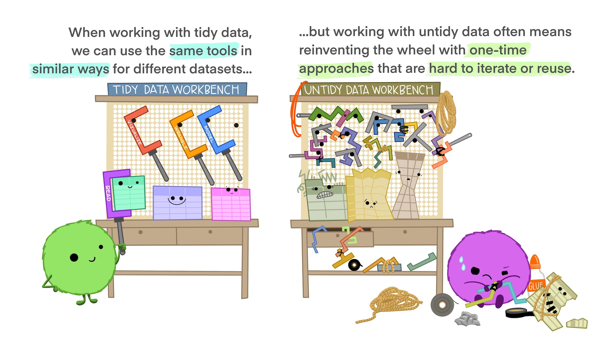
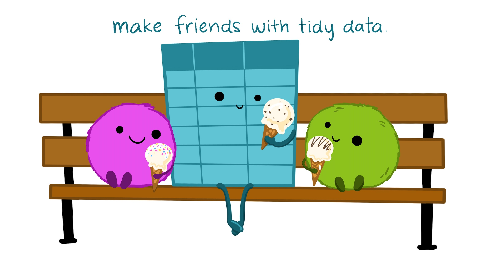

# Tidy data {#tidydata}

**Note:** all artwork in this chapter are from an illustrated collaborative [Openscapes blog post](https://www.openscapes.org/blog/2020/10/12/tidy-data/) by Dr. Julia Lowndes and Dr. Allison Horst [@lowndes_tidy_2020], and many of the ideas here are building upon the main points in that post.

Tidy data is a predictable way to organize data that makes it more coder and collaborator friendly. As described by Hadley Wickham, **in *tidy data* each column is a variable, each row is an observation, and each cell contains a single value (measurement)** [@wickham_tidy_2014].

{width="600"}

This may seem like a mundane topic, but tidy data provides a way of thinking about and organizing data that will become fundamental to how you input, wrangling, and work with environmental data - it becomes part of a systematic approach to working with data that **will make you a better data scientist and collaborator**.

## Common ways data are untidy

One way to understand tidy data is to consider what makes some data sets *untidy*. Let's explore some examples of untidy data, and for each think about (1) why it's untidy, and (2) how we would wrangle it to make it tidy data.

### Untidy example 1: A single variable across multiple columns

One of the most common ways that data can be untidy is if a single variable is broken up by group across multiple columns. For example, the following data contains the weights of three dogs, measured over four years:

```{r, echo = FALSE, message = FALSE, warning = FALSE}
library(tidyverse)
library(kableExtra)
dog_wt_wide <- tribble(~dog, ~'2018', ~'2019', ~'2020', ~'2021',
                       "Teddy", 36.4, 39.2, 44.8, 47.5,
                       "Khora", 41.6, 48.3, 52.9, 50.1,
                       "Waffle", NA, NA, 20.4, 23.7
)

dog_wt_wide %>% kable(caption = "Dog weight (pounds) in untidy format, where a single variable (weight) is spread out across different levels of the year variable.") %>% kable_styling(full_width = FALSE, position = "center")
```

In this example, there are really only 3 variables: dog name, dog weight, and year. But as organized, there are **5** columns - this should be our first indication that the data is not tidy. Instead of each variable occupying its own column, the **weight** measurements have been split up across multiple columns, separated by the different levels of **year**. Sometimes you will hear this called "wide format" when a single variable is spread across multiple columns.\
\
**What would this data look like if it were tidy?**\
\
To be in tidy data, each variable (**dog**, **weight**, and **year**) should have its own column. In this example, starting from the wide format data we need to reshape **weight** observations into a single column. Year will need to populate a new column, with year values repeated as necessary to align with the long-format weights. We'll also need to repeat the dog names to accommodate the number of observations for each.\
\
Later on, we'll hear how to reshape data from wide-to-long format (e.g. using `tidyr::pivot_longer()` in R), but for now think about the tidy format of the same data, shown below:

```{r, echo = FALSE, message = FALSE, warning = FALSE}
dog_wt_wide %>% pivot_longer(cols = '2018':'2021', names_to = "year", values_to = "weight") %>% 
  kable(caption = "Dog weight (pounds) in tidy format, where each variable is in its own column.") %>% 
  kable_styling(full_width = FALSE, position = "center")

```

### Untidy example 2: multiple values in a single cell

Another way that data can be untidy is if there are multiple "measurements" (or values) in a single cell. Keep in mind that a "value" doesn't have to be numeric - it's just a measurement or description for a recorded variable.

Sometimes raw data will contain multiple values in a single cell. For example, here we see that the make, model and year of cars are all in a single column called **type**:

```{r echo = FALSE, message = FALSE, warning = FALSE}

cars_untidy <- tribble(~type, ~color, ~condition,
                       "1994 Toyota Corolla", "silver", "poor",
                       "2005 Subaru Outback", "green", "average",
                       "1977 Datsun 710", "blue", "excellent")

cars_untidy %>% 
  kable(caption = "Car descriptions in untidy format.") %>% 
  kable_styling(full_width = FALSE, position = "center")

```

An important thing is to be future-thinking about data, and expect that **even if you don't think a specific question is important now, it may be important in the future** -- and having data in tidy format will make it easier to answer a wider range of questions with limited frustration. For example, maybe in the future (and if this were part of a larger data set) we would want to assess the condition of cars by year, or the color of cars by make and model. No matter how you slice those questions, having each variable in its own column will make them easier to explore and answer with code.\
\
In the future, you'll learn how to separate components of a single column into multiple columns (e.g. using the `tidyr::separate()` function), which in this example would help to create a tidy version of the data that looks like this:\

```{r, echo = FALSE}

cars_untidy %>% 
  tidyr::separate(col = type, into = c("year", "make", "model"), sep = " ") %>% kable(caption = "Car descriptions in tidy format.") %>% kable_styling(full_width = FALSE, position = "center")

```

**Untidy example 3: multiple observations in a single row**

Occasionally, you will see environmental data where information for *multiple observations are stored in a single row*. For example, this is common when research divers are estimating numbers of a certain species within different size bins. For example, a dive record may contain information like this:

```{r, echo = FALSE, message = FALSE, warning = FALSE}

invert_counted <- tribble(~species, ~size_cm, ~count,
                          "spiny lobster", 4.5, 2,
                          "spiny lobster", 5.0, 4,
                          "spiny lobster", 5.5, 0,
                          "spiny lobster", 6.0, 1,
                          "spiny lobster", 6.5, 3)

invert_counted %>% 
  kable(caption = "Spiny lobster counts by size.") %>% 
  kable_styling(full_width = FALSE, position = "center")

```

So in this case, we have multiple lobster observations occupying single rows (e.g. the second row actually contains data for four lobsters). On the spectrum of untidy data, this isn't too bad - but it can make it much easier (and less risky) to visualize and analyze the data if each observation is in its own row. We'll learn how to convert a **frequency table** (like this one, which contains counts) into **case format** (which does have a single row per observation, so that the data look something like this:

```{r, echo = FALSE, message = FALSE, warning = FALSE}

invert_counted %>% 
  uncount(count) %>% 
  kable() %>% 
  kable_styling(full_width = FALSE, position = "center")

```

Now, each individual lobster occupies its own row, and the data are in tidy format.

## Tidy data for predictable inputs

Tidy data structure will become so ingrained into your brain over the next year that you'll almost forget a universe when you didn't automatically strive to create tidy data. Estimates for the fraction of a data scientist's time spent wrangling and cleaning data (rather than analyzing / modeling / gaining valuable insights from data) ranges from \~45 - 80%. That should make us especially inspired to create the data we hope to see in the world. In other words, on the data collection end of data science we should strive to input data in an organized, predictable format (e.g. as tidy data), and as cleanly as possible (i.e. consistent, machine-friendly values).\

> **Question:** Are there times when tidy data structure is *not* the best format?
>
> **Answer:** Yup. There are very few "rules" in data science, and there will certainly be exceptions.

Tidy data gives us a predictable, organized data structure to strive for (unless we have good reason not to). Collecting data in tidy format from the get-go can reduce the time spent data wrangling / reshaping, and increase the time we can spend gaining insights to help solve environmental problems. And since all tidy data are similar in important ways, we can use similar tools in similar ways across different datasets, instead of hacking together new tools for each unique untidy dataset.

{width="601"}

An evergreen paper to learn about data organization - in spreadsheets, and anywhere else - is [*Data organization in spreadsheets*](https://www-tandfonline-com.proxy.library.ucsb.edu:9443/doi/full/10.1080/00031305.2017.1375989) by @broman_data_2018. This is required reading for EDS 221, and beautifully highlights a number of other important considerations for data organization. I recommend you re-read it every year for the rest of your data science life.

## Tidy data for easier analysis

The process of creating tidy data is useful in an of itself, because it requires us to be deliberate and thoughtful about how we structure our data, and makes us define our *variables*, *observations* and *measurements*. We will learn why that benefits us and our collaborators in the next section. Here, let's learn why tidy data is often code- and coder-friendly organization.

### Code working for you

One (of many) benefits of working with tidy data is that it can save you tedious and sometimes dangerous manual subsetting and calculations for different groups. That's because in most programming languages, there are functions that can recognize different groups existing withing a variable automatically, and you can then perform operations (e.g. to calculate means, create exploratory plots, etc.) by those auto-recognized groups.\
\
What?\
\
OK let's break it down a bit, by considering the different ways we could tackle a summary statistics challenge.\
\
Here is our mock data for dog hiking mileage and duration:

| name  | miles | time  |
|-------|:-----:|:-----:|
| Teddy |  6.8  | 35:02 |
| Khora | 10.3  | 61:47 |
| Teddy |  3.1  | 15:28 |
| Teddy | 12.0  | 87:09 |
| Khora |  4.9  | 20:56 |
| Teddy |  8.5  | 63:34 |
| Khora |  2.7  | 12:01 |
| Teddy |  5.9  | 43:40 |

If we want to calculate the mean miles *for each dog*, how might we go about doing that?

1.  We could manually create individual subsets for each dog (i.e., separate the two groups manually), then calculate the mean for each. That might not seem too bad for just two groups, but what if our data had 5 different dogs? Or 20 dogs? Or 1,000 dogs? Then creating and storing subsets manually before applying a function across all of them quickly becomes a big task.
2.  **Or instead**, we could expect code exists that could automatically recognize then create groups within the `name` column, and apply a function to each group. The second is more efficient - instead of actually creating separate subsets from the data, we just have our code recognize groups automatically, then apply a function (or functions) to each group, without ever separating the data in the first place. For simplest execution, it does require that your group values (here, dog names) are in a single column, which is one reason why organizing data in tidy format is useful for more efficient coding.

This isn't just true for finding summary statistics by group. We'll see that we can use groups within a variable to automatically facet graphs (present each group's data in its own plot), e.g. with `facet_wrap()` for data visualization with `ggplot2`, along with other common use cases for grouping data.

## Tidy data for skills transfer & collaboration

Because tidy datasets are fundamentally and predictably similar, it will make it easier for you and your collaborators to repurpose existing tools & skills to work with new tidy data.\
\
In other words, the data will differ, but the structure will be similar enough that we shouldn't feel like we need to reinvent the wheel every time we get a new tidy dataset.



Not only will tidy data allow you to use similar tools on different datasets, but it also allows *different people* to use similar tools on the same dataset.

{width="502"}

## Tidy data for automation & repetition

The predictable and consistent structure of tidy data also helps to facilitate automation using pre-built workflows and algorithms. For example, you might imagine a report that needs to be updated annually as new data comes in. If the raw data are in the same structure as those analyzed and reported on for previous years, then you are more likely to be able to fully or partially reuse code from your previous analyses to prepare your new report.


So think carefully about how you organize your data - whether you're collecting raw data from the field, or trying to clean up data from an external source for easier, more collaborative, and more automated processing. Make the tidy data you hope to see in the world - you, future you, and all of your collaborators will thank you for it.


