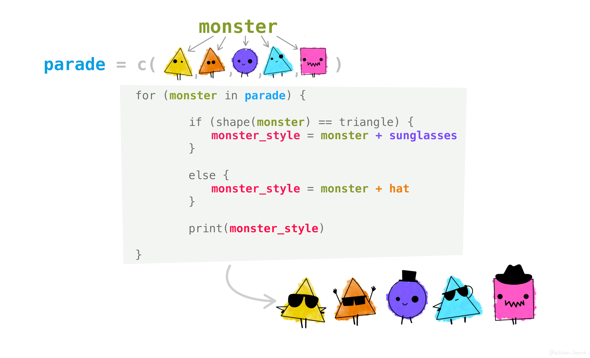

# Iteration {#iteration}

```{r echo = FALSE}
library(reticulate)
```


From Miriam-Webster Dictionary:

"**Iteration:** (*noun*) the action or a process of iterating or repeating, such as:

-   a procedure in which repetition of a sequence of operations yields results successively closer to a desired result
-   the repetition of a sequence of computer instructions a specified number of times or until a condition is met"

## Iteration in programming

In programming, iteration is repeating instructions. Usually it's to spare yourself from having to manually do a repetitious thing. Well-written iteration can also make code more readable, usable, and efficient (definitely to write, sometimes to run).

For example, let's consider a few scenarios that may prompt you to use iteration:

-   Your data contains 382 columns (variables), and you want to find the mean and standard deviation for each variable
-   You have 250 csv files and you want to read them all in and combine them into a single data frame
-   In a single data frame you have annual observations for fish passage from 1970 - 2019 recorded at 25 dams in Oregon, and you want to create and save a single graph for passage at each dam

...so basically, anything where you're like "Welp, I guess I'm going to be doing the same thing over and over and over and over..." should inspire you to consider iteration.

### A real-world example of iteration in environmental data science

## Generic for loop structure

When we iterate in code, most often that means we're writing some version of a for loop, which we can read as "For these elements in this thing, do this thing to each and return the output, then move on to the next element until you reach the end or a stopping point." There are a bunch of variations on that, but that's the overarching idea.

For example, in the image below our vector is a parade of friendly monsters getting passed through a for loop. There are conditions within the for loop dictating which type of accessory each monster will get, based on their shape. Then the outcome is returned with `print()`. 

{width="669"}

In words, how can we describe what's happening in this for loop? As each monster is passed individually through the loop, **if it is a triangle**, then it gets sunglasses added to it -- that's why the first element in the output vector is a triangle monster with sunglasses. Then we move on to the second (orange) monster. Since they are also a triangle, they're assigned sunglasses. However, when we get to the **third** (purple) monster, it is **not** a triangle, and anything monster shape other than a triangle is assigned a **hat** - so we see the third output is the purple circle monster with a hat.

...and so on until all elements have been passed through the for loop or a stopping point is otherwise reached.

## A basic for loop in R and Python

Let's take a look at some basic for loops, written in both R and Python. 

#### Example 1: A vector of very good dogs

Here's our scenario: starting with a vector of dog names "Teddy", "Khora", and "Waffle", write a for loop that returns the statement "[dog name here] is a very good dog!"

**In R:**

```{r}
# Create the vector of names:
dog_names <- c("Teddy", "Khora", "Waffle")

# Run it through the loop:
for (i in dog_names) {
  print(paste(i, "is a very good dog!"))
}
```

**In Python:** 

```{python}
# Create the vector of names:
dog_names = ['Teddy', 'Khora', 'Waffle']

# Run it through the for loop:
for i in dog_names:
    print(i + " is a very good dog!")
```

#### Example 2: Hypotenuses!

For a vector of values `2, 3, 4, 5, 6, 7`, for any two sequential values, find the length of the hypotenuse if the two values are the lengths of sides of a right triangle. In other words, we'll find the hypotenuse length for right triangles with side lengths 2 & 3, 3 & 4, 4 & 5, etc. 

Recall the Pythagorean theorem: 

$$a^2 + b^2 = c^2$$

**In R:**

```{r}
# Make the vector of values: 
triangle_sides <- c(2, 3, 4, 5, 6, 7)

# Create the loop to calculate the hypotenuses: 
for (i in 1:(length(triangle_sides) - 1)) {
  hypotenuse = sqrt(triangle_sides[i]^2 + triangle_sides[i + 1]^2)
  print(hypotenuse)
}
```

**In Python:**

Recall: Python indexing starts at ZERO (i.e., the first element in a vector is referenced with `vec[0]`), and the syntax for squaring a value is `**`.

Another weird one: the `range()` function in Python "...returns a sequence of numbers, starting from 0 by default, and increments by 1 (by default), and stops **before** a specified number." So to create a sequence 0, 1, 2, 3, in Python you can use `range(4)`.

```{python}
# Import math library (sqrt() function is not native in Python):
import math

# Make the vector of values:
triangle_sides = [2, 3, 4, 5, 6, 7]

# Create the loop to calculate the hypotenuses: 
index_no = range(0, len(triangle_sides) - 1)

for i in index_no:
  hypotenuse = math.sqrt(triangle_sides[i]**2 + triangle_sides[i + 1]**2)
  print(hypotenuse)
```

```{python}
# Aside re: range...this returns sequence 0, 1, 2, 3
demo_vec = range(4)
for i in demo_vec:
  print(i)
```


