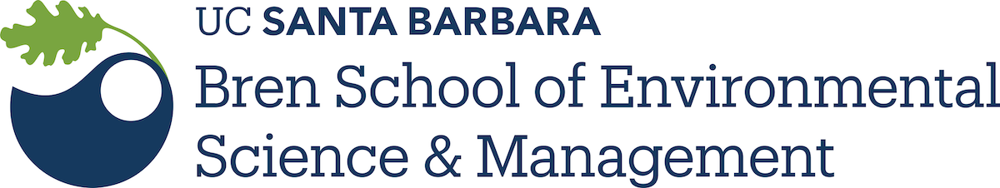

--- 
title: |
  {width=50%}
subtitle: "EDS 221: SCIENTIFIC PROGRAMMING ESSENTIALS"   
author: "by Allison Horst"
site: bookdown::bookdown_site
documentclass: book
bibliography: [book.bib, packages.bib]
biblio-style: apalike
link-citations: yes
description: "Evolving course materials for EDS 221 (Scientific Programming Essentials)."
---

# Scientific programming essentials for environmental data science

### Material disclaimer and use {-}

This book was created by [Allison Horst](www.allisonhorst.com) for EDS 221 (Scientific Programming Essentials) in the Bren School's 1-year [Master of Environmental Data Science program](https://bren.ucsb.edu/masters-programs/master-environmental-data-science) at UC Santa Barbara. It accompanies lecture, computational lab and discussion materials that may or may not be linked to throughout the book. This book is intended as a supplemental resource for some parts of the course. In other words, it is not intended as a standalone textbook. 

All materials in this book are openly available for use and reuse by CC-BY.

Thank you in advance for suggestions and corrections, which can be submitted as issue to this [GitHub repo](https://github.com/allisonhorst/eds-221). 

### Acknowledgements {-}

I create my courses while standing on shoulders of generous teaching and developing giants in R, data science, and education communities. The wealth and quality of open educational resources (OERs) in data science has made teaching in the field fun, innovative, and inspiring. I've tried to thoroughly credit authors resources that I have pulled from and adapted for this book, and I welcome additions if I have missed any that should be included. 

## Course introduction

```{r, echo=FALSE, out.width="100%", fig.cap="Slide from Dr. Julia Lowndes' 2019 keynote talk at useR conference (illustration by Allison Horst).", fig.align = "center"}
knitr::include_graphics("images/eds_r4ds.png")  
```

As nicely summarized in the title of a [2018 NCEAS post](https://www.nceas.ucsb.edu/news/next-generation-environmental-scientists-are-data-scientists), **"the next generation of environmental scientists are data scientists"**. Over the next year in MEDS you'll build skills to responsibly apply advanced methods in environmental modeling, spatial data analysis, machine learning, and more to investigate, analyze and communicate with complex environmental data.

To get there, you'll need a strong foundation in programming basics like: understanding types and structures of data, basic data wrangling and visualization, algorithm development with functions, loops, and conditionals, and how to troubleshoot. While working in the weeds of programming, we'll also learn and reinforce transferable habits for reproducible workflows, robust file paths, version control, data organization, project management, and more. 

In EDS 221 you'll also start building versatility by learning fundamental programming skills in different languages (R, Python) and integrated development environments (IDEs) like RStudio and PyCharm, while documenting our work in R Markdown and Jupyter Notebooks.

Upon the building blocks established in EDS 221, you'll be prepared to incrementally grow your advanced environmental data science toolkit throughout MEDS, then enter the workplace at the leading edge of quantitative methods in the field. 

## Links to other course materials

- Syllabus
- Code of Conduct
- Course website

## Course setup

We will use the following in EDS 221. You should have pre-installed recent versions before starting the course. 

- R (version XXXXX or higher)
- RStudio Desktop (version XXXXX or higher)
- RStudio Cloud (create a free account)
- Python (version XXXXX or higher)
- Pycharm (version XXXX or higher)
- Jupyter ()

## Course resources
